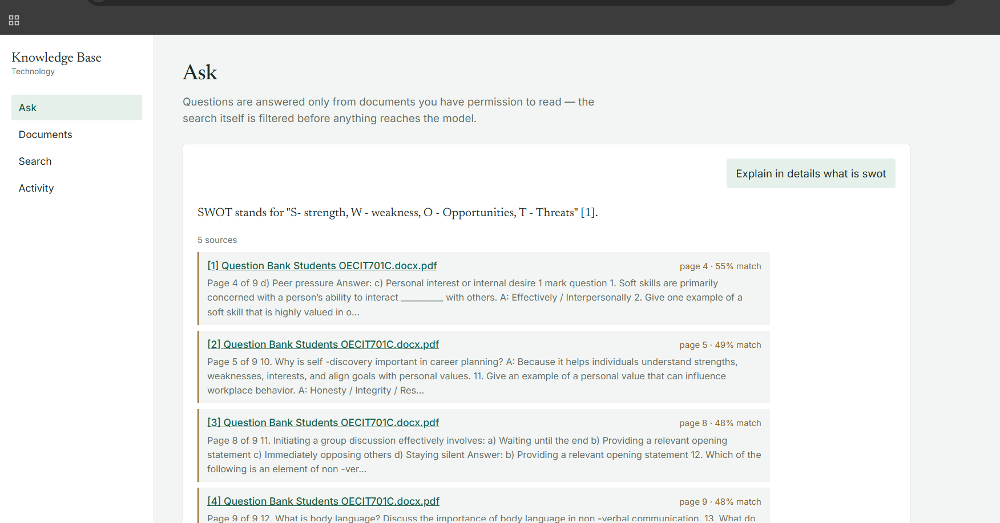

# document-ai

A permission-aware document knowledge base. Upload PDFs, Word files and
spreadsheets; they're split into passages, embedded, and stored in Postgres
with pgvector. Ask a question and get an answer drawn only from documents
**you are allowed to read**, with the file and page cited for every claim.



The interesting problem isn't retrieval — it's making sure retrieval can't
leak. Access control is enforced inside the vector search itself, so a
document you can't read is never ranked, never enters the prompt, and can't
surface through the model's wording.

---

## Highlights

- **Retrieval-time access control.** The allowed document list is computed
  server-side and applied in the SQL `WHERE` clause of the similarity search,
  not filtered after the fact.
- **Grounded answers with structural citations.** Sources come from the
  chunks actually retrieved, not parsed from model output, so a citation
  can't point at something the model never saw.
- **Follow-up questions that work.** "Tell me more about this" is rewritten
  into a standalone question before searching, so conversations flow
  naturally without weakening the permission boundary.
- **Measurable refusal.** Below a similarity floor the LLM is never called;
  the app says so, and the dashboard counts how often it happens.
- **Provider-agnostic LLM layer.** Runs on Google Gemini through its
  OpenAI-compatible endpoint; switching providers is a configuration change,
  not a code change.

---

## Architecture

| Service | Stack | Responsibility |
|---|---|---|
| `client/` | React + Vite | UI |
| `server/` | Node + Express | auth, documents, permissions, analytics — the only service the browser talks to |
| `ai-service/` | Python + FastAPI | extraction, chunking, embeddings, retrieval, RAG, summarisation |
| Postgres 17 | + pgvector | relational data and embeddings in one database |

### How a question gets answered

```
Browser ──► Node ──────────────────────────────► Python ──► Postgres
            1. verify JWT                        5. rewrite follow-up into
            2. compute allowed_document_ids         a standalone question
               from role + explicit shares       6. embed it
            3. load recent turns of this         7. vector search,
               user's own conversation              filtered to allowed ids
            4. forward question, history         8. build prompt from top-k
               and allowed ids                   9. call LLM
           11. persist both turns + audit  ◄──── 10. answer + structured sources
```

**Step 2 is the part that matters.** Filtering after retrieval would already
have placed restricted text in front of the model. See
`server/src/services/permission.service.js` and
`ai-service/app/core/retriever.py`.

The AI service derives no permissions of its own. It sits behind a shared
`X-Internal-Key` header and should never be exposed publicly.

---

## Permissions

| Role | Sees |
|---|---|
| `admin` | every document |
| `manager` | own documents, documents shared with them, and their department's |
| `employee` | own documents and documents shared with them |

Per-document shares grant `view`, `comment`, `download`, `edit` or `admin`;
the strongest applicable level wins. Every `/api/documents/:id` route runs
`requireDocumentPermission(...)` before the handler, so authorisation isn't
something the frontend can skip.

### Verified behaviour

Tested manually against the seeded accounts, with a document uploaded by the
admin (Technology department):

| Scenario | Expected | Result |
|---|---|---|
| Employee, not shared — document list | hidden | ✅ |
| Employee, not shared — asks about its contents | "couldn't find", no sources | ✅ |
| Manager, different department — asks about it | blocked | ✅ |
| Admin shares with employee — employee asks again | answered, with citations | ✅ |
| Follow-up "tell me more about this" after a SWOT question | rewritten to "Tell me more about SWOT analysis." and answered | ✅ |

The second row is the one that matters: the UI hiding a document proves
little if the search can still reach it.

---

## Running it locally

**Requirements:** Node 20+, Python **3.12**, PostgreSQL 17 with pgvector,
and a Gemini API key (free tier works — [aistudio.google.com](https://aistudio.google.com)).

> Python 3.12 specifically. Several pinned dependencies (`psycopg-binary`,
> `pydantic`, `tiktoken`) have no prebuilt wheels for 3.13+ at these versions
> and fail to install.

### 1. Database

**With Docker** (includes pgvector, runs migrations on first boot):

```bash
docker compose -f infra/docker-compose.yml up -d postgres
```

**Without Docker, on Windows:** the EDB PostgreSQL installer does *not*
include pgvector. Install PostgreSQL 17, then add a prebuilt pgvector build
matching your major version (e.g. from
[andreiramani/pgvector_pgsql_windows](https://github.com/andreiramani/pgvector_pgsql_windows)),
or compile it from source with the Visual Studio C++ build tools. Then:

```bash
psql -U postgres -c "CREATE DATABASE document_ai;"
psql -U postgres -d document_ai -c "CREATE EXTENSION vector;"
psql -U postgres -d document_ai -f infra/migrations/001_init.sql
```

Verify with `\dt` — you should see 10 tables including `document_chunks`.

### 2. Configuration

```bash
cp server/.env.example server/.env
cp ai-service/.env.example ai-service/.env
cp client/.env.example client/.env
```

`INTERNAL_API_KEY` must be identical in `server/.env` and `ai-service/.env`.
Set `JWT_SECRET`, `DATABASE_URL`, and your Gemini key — see
[Configuration](#configuration).

### 3. Services (one terminal each)

```bash
# AI service — :8000
cd ai-service
python -m venv venv
venv\Scripts\activate          # macOS/Linux: source venv/bin/activate
pip install -r requirements.txt
uvicorn app.main:app --reload --port 8000

# API — :4000
cd server
npm install
npm run seed
npm run dev

# Client — :5173
cd client
npm install
npm run dev
```

`npm run seed` creates one account per role, all with password `password123`:
`admin@acme.test`, `manager@acme.test`, `emp@acme.test`.

### 4. Check it works

```bash
curl localhost:8000/health     # {"status":"ok","database":"ok"}
```

Then log in at `localhost:5173`, upload a document, wait for **Ready**, and
ask a question about it.

---

## Configuration

`ai-service/.env`

| Variable | Value used | Notes |
|---|---|---|
| `OPENAI_API_KEY` | Gemini key | name is historical; holds any OpenAI-compatible provider's key |
| `OPENAI_BASE_URL` | `https://generativelanguage.googleapis.com/v1beta/openai/` | omit to use OpenAI directly |
| `EMBEDDING_MODEL` | `gemini-embedding-001` | |
| `EMBEDDING_DIM` | `1536` | must match `VECTOR(n)` in the migration |
| `LLM_MODEL` | `gemini-3.1-flash-lite` | used for answers and for rewriting follow-ups |
| `TOP_K` | `5` | passages retrieved per question |
| `SIMILARITY_THRESHOLD` | `0.35` | cosine floor; below it, the LLM isn't called |
| `CHUNK_TOKENS` / `CHUNK_OVERLAP` | `600` / `80` | |

---

## Engineering notes

**Follow-up questions are rewritten, not appended.** Vector search can't
match "tell me more about this" — those words mean nothing without the
conversation. Rather than stuffing old messages into the answer prompt, the
last six turns are used for one purpose only: rewriting the latest message
into a standalone question ("Tell me more about SWOT analysis."). That
rewritten question is what gets embedded, searched and answered. Three
properties follow from this:

- **The permission filter is untouched.** The rewritten question goes
  through exactly the same filtered search as any other.
- **History can't leak.** Node loads it from the user's own verified session,
  so it only ever contains questions they asked and answers they were
  already shown.
- **It fails safe.** If the rewrite call errors or times out, the original
  question is searched instead. Memory is an improvement, never a new way
  for a question to fail.

The rewritten question is returned as `search_query` and stored in the audit
log, so every follow-up's interpretation can be inspected.

**Switching from OpenAI to Gemini without rewriting the client.** Gemini
exposes an OpenAI-compatible endpoint, so the existing `openai` SDK calls stay
unchanged; only the base URL and model names moved into configuration. The
same two variables point the service at any compatible provider.

**Keeping 1536 dimensions under pgvector's index limit.** `gemini-embedding-001`
returns 3072-dimensional vectors by default, but pgvector's HNSW index supports
at most 2000. Rather than dropping the index or changing the schema, the
service requests reduced-dimension output (`dimensions=1536`), which the model
supports natively. The schema, index and similarity threshold stay as they were.

**Answer length adapts to the question.** Simple factual questions get a
sentence or two; requests to "explain" or "describe" get fuller answers with
markdown lists. The model is still barred from padding beyond what the
retrieved passages say, so a detailed question about a thin document gets a
short, honest answer rather than an invented long one.

**Embedding dimension is checked at runtime.** If the model and the
`VECTOR(n)` column ever disagree, `embeddings.py` fails loudly instead of
writing wrong-sized vectors.

**Ingestion is asynchronous.** `/internal/ingest` returns immediately and
processes in a background task; the client polls `/status`. Chunks are
embedded in batches of 96, so a large document is a handful of API calls
rather than hundreds.

**Chunking is paragraph-aware.** Splitting on raw token counts cuts sentences
and produces chunks that embed badly, so `chunking.py` packs whole paragraphs
up to the token budget and only hard-splits a paragraph that is itself too long.

**HNSW, not IVFFlat.** IVFFlat needs training data to build a good index and
would be created on an empty table. HNSW works from the first row.

**OCR is optional.** Pages with no text layer fall back to `pytesseract` +
`pdf2image` if installed, and are skipped otherwise.

---

## Troubleshooting

| Symptom | Cause | Fix |
|---|---|---|
| `relation "document_chunks" does not exist` | pgvector missing; migration skipped the one table using `VECTOR` | install pgvector, `CREATE EXTENSION vector;`, re-run the migration |
| `Client.__init__() got an unexpected keyword argument 'proxies'` | `openai==1.35.0` with httpx ≥ 0.28 | `pip install "httpx<0.28"` (already pinned in `requirements.txt`) |
| `No matching distribution found for psycopg-binary` | Python 3.13+ | use Python 3.12 |
| `models/... is not found for API version` | retired model name | list available models with `client.models.list()` |
| UI shows "Something went wrong on our side" | Node forwards a 5xx from the AI service | the real traceback is in the uvicorn terminal |
| uvicorn stuck on "Waiting for background tasks to complete" | a file was saved while a request was in flight, and the reload hung | Ctrl+C and start uvicorn again |

---

## Known limitations

- **Memory lasts one page visit.** A new conversation starts each time the
  Ask page loads; past conversations are stored but there's no UI yet to
  reopen them.
- **Follow-ups cost one extra model call.** Rewriting runs only when there is
  history, but it does add latency and quota usage to every follow-up.
- **Background tasks aren't durable.** A restart mid-ingestion leaves the
  document in `processing`. A real deployment needs a job queue.
- **Free-tier data terms.** On Gemini's free tier, inputs may be used to
  improve Google's models — fine for test documents, not for real company data.
- **Permission tests are manual.** The matrix above should become an automated
  integration test.

## Worth building next

Automated permission tests · streaming answers (SSE) · a conversation list to
reopen past chats · retry and delete for failed uploads · a durable job queue
(BullMQ / Celery) · rate limiting on the question endpoint · automatic tagging
at ingest time.